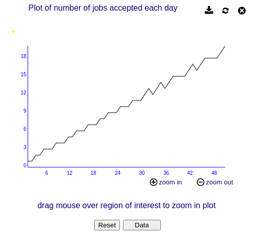
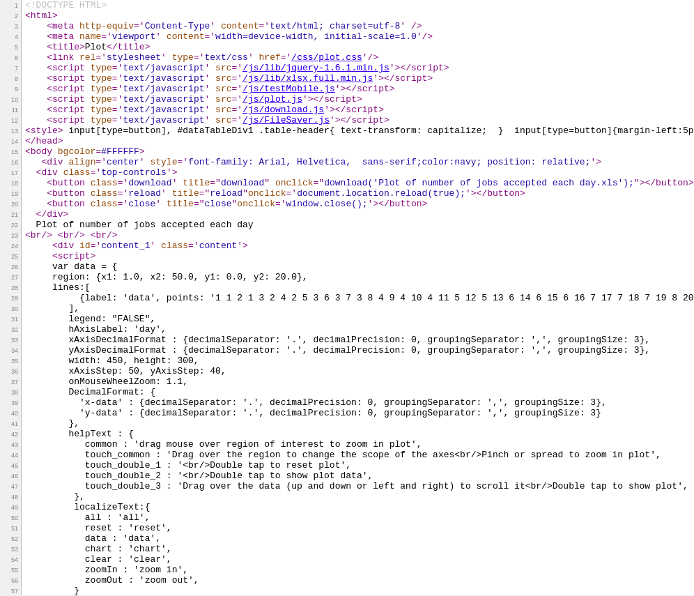

I am *awful* at sticking to a routine - the only thing I can bear to check on every day is Twitter. Even if it means spending twice as long over the course of a weekend, I will *always* try to find a way to automate away routine manual work.

(All of the code used in this post can be found [here.](https://github.com/Spelkington/LittlefieldDriver/blob/main/ipynb/driver.ipynb))

## Too much time to kill

This Monday, I started the last major semester of my undergraduate career. That's right, folks - after six years, four program changes, and [one brain surgery](https://youtu.be/lMFQp3wN-cg?t=521) (which, in my personal opinion, is one too many), I will *finally* be wrapping up my degree! 

My last two semesters will be my first part-time courseloads of my academic career, which leaves me quite a bit of extra time. Coupled with the fact that I've been couped up with a case of meningitis for the last few days (of all things to catch during 2021), I took a bit of extra time to go over the top in a class I'm taking on operations and supply chain management.

## Introducing: Littlefield

As part of the course, we'll be spending four weeks in [the operations simulation Littlefield](http://responsive.net/littlefield.html). The premise of Littlefield is to tune parameters - things like orders taken and machines purchased - to optimize the profit of a simulated production line. The simulation itself runs a bit faster than real time. Over the course of five full calendar days, one session of the game simulates 250 days of work.

In the words of the course instructors:

> the game is set up to give you the flexibility of checking it **at your convenience** (at any time of day or night)

The problem? **I'm a walking dumpster fire when it comes to routinely checking on** ***anything.***

My email inbox is constantly full. I am always running on a quarter tank of gas.  I've never even kept a house plant alive for more than a week - I'm responsible for the early death of more succulents than I would ever care to admit.

In the honest-to-God words that my fourth grade teacher wrote on my report card, I am somebody who is "lazy to the point of efficiency." If there is any way for me to put in all of the work up front, I *will* find a way.

## Web Scraping 101

As somebody who has been lazy for 23 years now, I've become well-acquainted with the concept of **web scraping.** This is a method for accessing websites using a program instead of your browser. If your job ever involves going to a massive number of web pages and finding specific information - as a few of my internships have entailed from time to time - it's a fantastic way to avoid the grunt work of going to each individual page by hand. For example, rather than employing an army of people to go through every web page on the internet and keep track of keywords, Google instead uses an army of web scrapers to do all that work for them.

Littlefield, like the rest of everything on the internet, is scrape-able as well. The game is hosted on a web page that looks like this:


While the page is different - and a bit harder to scrape - than your average news article or social media page, it's still just a set of links that we can get information from. Each node of the graph above leads to a page full of data about the game. If were playing this by hand, we would log in a few times each day, open up each page, and see if there were any issues or bottlenecks in need of fixing.

It takes about five minutes to check everything - five *exhausting* minutes.

Instead of taking five minutes to check this data myself, I have - as the rational person I am - spent the last six hours creating a program that can check it for me: [the Littlefield Driver.](https://github.com/Spelkington/LittlefieldDriver)

## The Littlefield Driver

The Littlefield Driver is a program that takes all of the data about the state of the game - things like machine utilization, cash on hand, and orders placed - and compiles it into one data table I can look at, graph, and use to diagnose any issues that may be the case. The program is based on [a 2017 project by Greg Lewis](https://medium.com/@gregdlewis/scraping-the-littlefield-simulation-with-python-a6bf618c6833), who was (at the time) an MBA student at the University of Maryland. Lewis wasn't alone - developer [Jiayu Yi](https://blog.jiayu.co/) created [an export kit for Littlefield](https://github.com/yi-jiayu/littlefield) back in 2017 as well.

Ideally, my Littlefield Driver will have a bit of extra functionality beyond data export, but the spirit of automation is still the same. By the end of the project, the goal will be to let the Littlefield Driver use incoming data to automate machine production in the background, and maybe even send me a notification if (or when) something goes horribly wrong.

The first order of business for the bot is to take the structure of the game and represent it as a network graph.

Here's what the driver sees when it opens up the game:

```
> lfdriver.draw_graph()
```


It's... admittedly not very pretty. At the very least, though, it shows that the program is seeing what we're seeing: the production line starts at the Orders & Material menus, which goes to the first queue, which feeds into the first station, *et cetera*.

## HTML is the least romantic language

When a web page is sent to your computer for your viewing pleasure, it's sent as **Hypertext Markup Language**, or **HTML** for short. Normally, we don't have to deal with HTML directly. The entire point of your web browser is to read the HTML and turn it into something clean, pretty, and - most importantly - human-readable. Scraping the web, however, means that we *do* need to read the HTML directly in order to pick out the parts we want the computer to look for.

Our target for the first round of web scraping is going to be the Littlefield data pages. These data pages give you the historical plot of whatever the selected node of the graph represents. For example, this is the data page for how many incoming job requests are received every in-game day:



(as an aside, every time you open a data view, it annoyingly opens as an *entirely new window*, which means playing Littlefield often looks like [this](../assets/littlefield/clutter.png))

I can *always* appreciate a clean-looking graph.

To make that graph, it's actually your web browser doing all the work to turn the HTML into a neat visualization. *This* is what your computer is *actually* sent:



Even when you're making a website, reading through raw HTML is *rarely* ever a fun time. Thankfully, the data we're looking for is on line 29, smack-dab in the middle of the page:

```
{label: 'data', points: '1 1 2 1 3 2 4 ...}
```

That's the data that your browser is using to create the plot from the first image. It's a bit weird that it's all one line, but we can pick up from context that the data is being provided in pairs - the first number is the day, then the next is the datapoint - repeated over and over again. You could read it as:

```
Day 1: 1 job | Day 2: 1 job | Day 3: 2 jobs | ...
```

Thankfully, the data is delivered in the same way for every single data page, from the orders received to the utilization of each station. All we have to do is write the code once, give the program all the data pages, and let it run. Instead of one string of data, we can tell it to put the data in nice, neat *human-readable* columns like this:

| Day         | JOBIN       |
| ----------- | ----------- |
| 1           | 1           |
| 2           | 1           |
| 3           | 2           |
| 4           | 2           |
| 5           | 3           |
| 6           | 3           |

After scraping every single page of data in the game, we can smash it all together and get a *beautiful* chart!

```
lfdriver.data()
```


This chart just shows the first and last 10 days of the historical data, and even from this we can gain some insights. S3UTIL, which represents the current utilization of the third station, is at 67% on Day 50 of the simulation. Judging by the rate of increase - roughly 1.3% every day on average - we should probably consider buying another machine at Station 3 prior to Day 75.

Of course, that's just an estimate. The purpose of the Driver is to check in on the game routinely to see if there are any critical issues. For example, the Driver can check to see if a station utilization is at a high percent and calculate whether or not it would be profitable to order a new machine.

## Everything is done - *for now*

At the time of writing this, I haven't actually *played* a game of Littlefield - everything written so far was done on a static sample game. This means I haven't had access to some features - like purchasing machines - so they haven't been added to the Littlefield Driver... *yet.* Additionally, there's some system variables - such as the cost of a new machine - that are available in the data but aren't available in the Driver.

Ultimately, this is a god-awful way to play the game. With 12 years in development and only 2 examples (that I've found) of people attempting to automate the game, the game is *clearly* playable by hand. You might ask, then - why put in all this effort?

The real question is: why *not*?